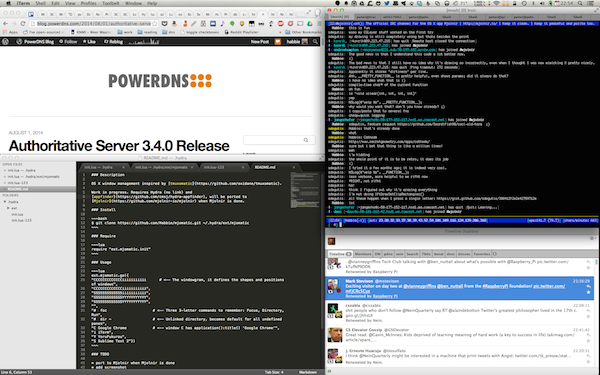

### Description

OS X window management inspired by [tmuxomatic](https://github.com/oxidane/tmuxomatic).

Work in progress. Requires Hydra (no link) and 
[appfinder](https://github.com/cmsj/hydra-appfinder), will be ported to 
[Mjolnir](https://github.com/mjolnir-io/mjolnir) when Mjolnir is done.

### Install

~~~bash
$ git clone https://github.com/Habbie/mjomatic.git ~/.hydra/ext/mjomatic
~~~

### Require

~~~lua
require "ext.mjomatic.init"
~~~

### Usage

~~~lua
ext.mjomatic.go({
"CCCCCCCCCCCCCiiiiiiiiiii      # <-- The windowgram, it defines the shapes and positions of windows",
"CCCCCCCCCCCCCiiiiiiiiiii",
"SSSSSSSSSSSSSiiiiiiiiiii",
"SSSSSSSSSSSSSYYYYYYYYYYY",
"SSSSSSSSSSSSSYYYYYYYYYYY",
"",
"C Google Chrome            # <-- window C has application():title() 'Google Chrome'",
"i iTerm",
"Y YoruFukurou",
"S Sublime Text 2"})
~~~

### Screenshot



### TODO

* port to Mjolnir when Mjolnir is done
* add screenshot
* modularize code
* now that we have busted for testing, I noticed we sometimes send floats to setframe, with risk of off-by-one (pixel) errors. Move to integers in a consistent grid.
* support whitespace at the end of a windowgram line (right now we require all lines to be the same length, instead we should take the length of the longest line as our grid width)
* support more than one window per application, with some smart window selection
* support more than one screen, plus spaces(?)
* read from configfile instead of awkward table-of-lines in init.lua (or are bracket strings good enough?)
* Terminal/iTerm snap their size to fit an integer number of rows/columns of text. Compensate for that. [related Mjolnir feature request](https://github.com/mjolnir-io/core.window/issues/10)

### Ideas
Support overlapping windows? Right now this already works (I think):
```
MMMM
MxxM
MxxM
```
but it's not very flexible. Idea: make indented lines 'apply' to the previous line. I.e.   this will give you two entirely overlapping windows of size 2*2:
```
MM
 xx
MM
 xx
```
